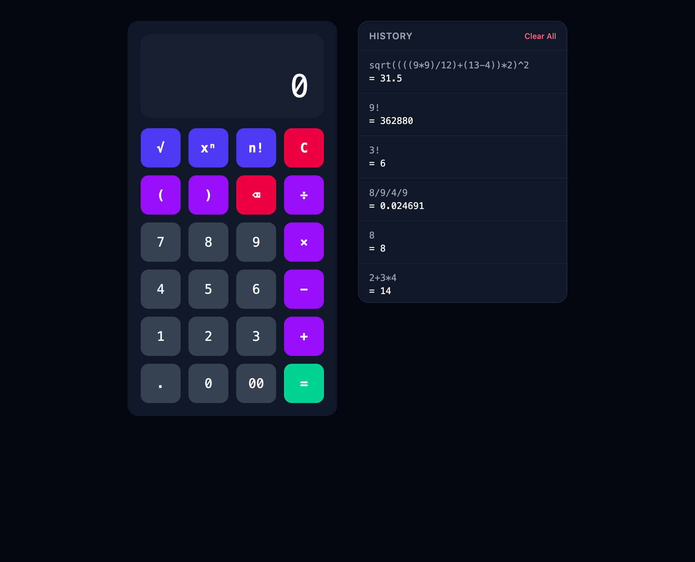

# CalcTek Calculator

An API-driven calculator built with Laravel 12 and Vue 3, featuring a persistent ticker tape history and a dark-themed responsive interface.



---

## Architecture Decisions

The backend follows a strict **interface → service → controller** pattern. `CalculatorService` depends on `ExpressionParserInterface`, never on a concrete parser. This means the expression evaluation strategy can be swapped — from the current `mossadal/math-parser` to a recursive descent parser or `symfony/expression-language` — without modifying the service or controller. The controller is deliberately thin: it orchestrates input validation, delegates to the service, and returns a resource-formatted response.

## Parser Strategy

I avoided PHP's `eval()` entirely. The `BasicExpressionParser` uses [mossadal/math-parser](https://github.com/mossadal/math-parser) to tokenize and evaluate expressions via an AST. This eliminates code injection risk at the parser level while supporting operator precedence, parentheses, and decimal arithmetic.

**Tradeoff:** For a production system with complex business logic, [symfony/expression-language](https://symfony.com/doc/current/components/expression_language.html) would be a stronger choice — it offers a sandboxed evaluation environment with variable binding and caching. For this project's scope (arithmetic expressions only), `mossadal/math-parser` is the simpler, more focused tool.

The parser is injected via `ExpressionParserInterface`, making it replaceable without modifying the service — an application of the Open/Closed and Dependency Inversion principles.

## SOLID Principles

- **Single Responsibility**: `CalculatorService` evaluates. `CalculationResource` formats. `CalculationRequest` validates. `CalculationController` orchestrates. Each class has one reason to change.
- **Open/Closed**: New parsers extend the system by implementing `ExpressionParserInterface`. Existing classes remain untouched.
- **Liskov Substitution**: Any `ExpressionParserInterface` implementation is drop-in replaceable — the service calls `parse()` and expects a `float` or a domain exception.
- **Interface Segregation**: `ExpressionParserInterface` has exactly one method: `parse(string $expression): float`.
- **Dependency Inversion**: `CalculatorService` depends on the abstraction (`ExpressionParserInterface`), bound to the concrete `BasicExpressionParser` in `AppServiceProvider`.

## DRY

- Validation rules live exclusively in `CalculationRequest` — never duplicated in controllers.
- Response shaping lives exclusively in `CalculationResource` — no manually built arrays anywhere.
- Error-to-HTTP mapping lives exclusively in `bootstrap/app.php` exception handlers — no try/catch in controllers.
- Error messages are centralized in `lang/en/calculator.php`.

## KISS

- `CalculatorService` is 12 lines. It delegates to the parser and nothing else.
- The project uses Laravel's built-in tools (Form Requests, API Resources, Exception Handler) rather than custom abstractions.
- One responsibility per class, one concern per method.

## TDD Approach

Every feature was built using **red-green-refactor** with vertical slices:

1. Write one failing test describing a specific behavior
2. Write the minimum production code to make it pass
3. Refactor, then move to the next behavior

This produced **10 unit tests** (CalculatorService: arithmetic, precedence, decimals, parentheses, error cases) and **11 feature tests** (API: store, validation, index, delete, clear). Tests verify behavior through public interfaces — they would survive an internal refactor of the parser without modification.

## Database Index Rationale

The `calculations` table has a composite index on `(created_at, id)`. The ticker's primary query is:

```sql
SELECT * FROM calculations ORDER BY created_at DESC, id DESC LIMIT 50;
```

The composite index lets the database satisfy both the sort and the limit via an index scan — no full table sort required. The `id` column serves as a tiebreaker for rows with identical timestamps, which matters under concurrent inserts. This index was defined at migration time to communicate that query patterns were considered upfront.

## Running the Backend

```bash
composer install
cp .env.example .env
php artisan key:generate
php artisan migrate
php artisan serve
```

## Running the Frontend

```bash
npm install
npm run dev
```

> **Note:** If you see `EACCES: permission denied` errors from Vite related to `node_modules/.vite`,
> it means `node_modules` was installed with elevated permissions. Fix ownership with:
> ```bash
> sudo chown -R $(whoami):staff node_modules
> ```
> Then restart `npm run dev`.

Visit `http://localhost:8000` to use the calculator.

## Running Tests

```bash
php artisan test
```

## Stretch Goal: Complex Expressions

The calculator supports advanced functions like `sqrt()`, `^` (exponentiation), `!` (factorial), and all 30+ functions provided by `mossadal/math-parser` (trig, log, abs, etc.). Only the validation regex and frontend keypad needed updating — the parser already supported everything out of the box.

**A note on the example expression:** It took me quite some time to figure this out, but the expression shared in the interview file — `sqrt((((9*9)/12)+(13-4))*2)^2)` — has an extra `)` at the end, making it syntactically invalid. The correct, balanced expression is `sqrt((((9*9)/12)+(13-4))*2)^2`, which evaluates to **31.5**.

## Tradeoffs and Improvements at Scale

- **Parser**: For production, I'd evaluate `symfony/expression-language` for its sandboxed environment, variable binding, and expression caching.
- **Rate limiting**: The API currently has no rate limiting. Laravel's built-in `ThrottleRequests` middleware should be applied to prevent abuse.
- **Pagination**: The ticker loads the last 50 calculations. At scale, cursor-based pagination would replace the fixed limit.
- **Multi-tenancy**: The composite index would shift to `(user_id, created_at, id)` once user scoping is added.
- **Summary tables**: If dashboards with aggregations (count, average, frequency) are needed, a precomputed summary table would avoid expensive queries against the main table.
- **Queue**: Heavy or chained calculations could be offloaded to a queue with Redis, returning a job ID for polling.
- **Frontend testing**: Vue component tests with Vitest would round out the test coverage.
